# LVM — Creation Guide

## Diagram



> Creation order: **bottom to top**. Usage order: top to bottom.

---

## Steps to create LVM from scratch

**Step 1 — Add physical disks** (if needed, from the KVM host)

```bash
qemu-img create -f qcow2 /home/vms/sdb.qcow2 5G
qemu-img create -f qcow2 /home/vms/sdc.qcow2 5G

virsh attach-disk almalinux9-rhcsa /home/vms/sdb.qcow2 sdb --driver qemu --subdriver qcow2 --persistent
virsh attach-disk almalinux9-rhcsa /home/vms/sdc.qcow2 sdc --driver qemu --subdriver qcow2 --persistent
```

**Step 2 — Verify the disks are visible**

```bash
lsblk
# Expected: /dev/sdb and /dev/sdc visible
```

**Step 3 — Partition both disks with gdisk** (type `8e00` for LVM)

```bash
gdisk /dev/sdb
# n → 1 → Enter → +2G → 8e00 → w → y   (/dev/sdb1)
# n → 2 → Enter → Enter → 8e00 → w → y  (/dev/sdb2)

gdisk /dev/sdc
# n → 1 → Enter → +2G → 8e00 → w → y   (/dev/sdc1)
# n → 2 → Enter → Enter → 8e00 → w → y  (/dev/sdc2)
```

**Step 4 — Create Physical Volumes**

```bash
pvcreate /dev/sdb1 /dev/sdb2 /dev/sdc1 /dev/sdc2
pvs
```

**Step 5 — Create Volume Group** (combining all 4 PVs into one pool)

```bash
vgcreate primary_vg /dev/sdb1 /dev/sdb2 /dev/sdc1 /dev/sdc2
vgs
```

**Step 6 — Create Logical Volumes**

```bash
lvcreate -L 3G -n home_lv primary_vg
lvcreate -L 3G -n data_lv primary_vg
lvs
```

**Step 7 — Format the Logical Volumes**

```bash
mkfs.ext3 /dev/primary_vg/home_lv
mkfs.xfs  /dev/primary_vg/data_lv
```

**Step 8 — Create mount points and mount**

```bash
mkdir -p /home
mkdir -p /data
mount /dev/primary_vg/home_lv /home
mount /dev/primary_vg/data_lv /data
```

**Step 9 — Make mounts persistent in /etc/fstab**

```bash
blkid /dev/primary_vg/home_lv
blkid /dev/primary_vg/data_lv

vim /etc/fstab
# UUID=xxx  /home  ext3  defaults  0 0
# UUID=xxx  /data  xfs   defaults  0 0

mount -a
systemctl daemon-reload
```

---

## Key verification commands

```bash
pvs          # list physical volumes
vgs          # list volume groups
lvs          # list logical volumes
pvdisplay    # detailed info on PVs
vgdisplay    # detailed info on VGs
lvdisplay    # detailed info on LVs
df -h        # verify mounted filesystems
```

---

## Exam tips

- Always use type `8e00` when partitioning with `gdisk` for LVM
- After editing `/etc/fstab`, always run `mount -a` to catch errors before rebooting
- Use UUID in fstab, not device names — device names can change, UUIDs never do
- Run `systemctl daemon-reload` after every fstab change
- To add more space later: `vgextend primary_vg /dev/sdd1` then `lvextend` + `xfs_growfs`

-

## LVM — Deletion / Cleanup Guide (Lab Reset)


**Step 1 — Remove Logical Volumes**

```bash
lvremove /dev/vg_lab/lv_data
```

**Step 2 — Remove Volume Group**

```bash
vgremove vg_lab
```

**Step 3 — Remove Physical Volume**

```bash
pvremove /dev/vdb2
```

**Step 4 — Remove partition with gdisk (GPT)**

```bash
gdisk /dev/vdb
# p   → verify
# d   → delete partition
# 2   → select vdb2
# w   → write changes
```

**Optional — Full disk reset (wipe all partitions)**

```bash
gdisk /dev/vdb
# o   → create new empty GPT
# w   → write
```

**Verification**

```bash
pvs
vgs
lvs
lsblk
```

**Expected result:**
- No `vg_lab`
- Disk `/dev/vdb` clean or without LVM

